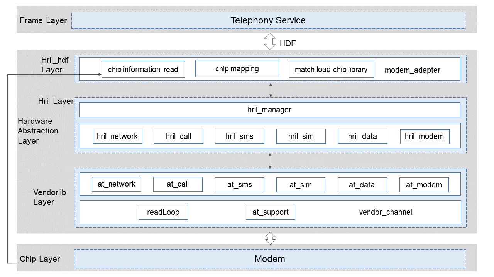

# RIL Adapter<a name="EN-US_TOPIC_0000001106353742"></a>

-   [Introduction](#section117mcpsimp)
-   [Directory Structure](#section122mcpsimp)
-   [Constraints](#section126mcpsimp)
-   [Usage Guidelines](#section264mcpsimp)
-   [Repositories Involved](#section279mcpsimp)

## Introduction<a name="section117mcpsimp"></a>

The RIL Adapter module provides functions such as vendor library loading, service interface implementation, and event scheduling and management. The module shields the differences of modems supplied by different vendors to provide a unified interface for the telephony service layer. It communicates with the telephony service layer by registering a Hardware Driver Foundation \(HDF\) service.

**Figure  1**  Architecture of the RIL Adapter module<a name="fig1675210296494"></a>


## Directory Structure<a name="section122mcpsimp"></a>

```
base/telephony/ril_adapter
├─ hril				# Implementation of each business module interface of the hri layer 
├─ hril_hdf			# HDF service 
├─ include          # Header files
├─ interfaces		# Provide internal interfaces for each business 
│  └─ innerkits
├─ test             # Test code
│  ├─ mock
│  └─ unittest      # Unit test code
└─ vendor           # Vendor lib code
│  └─ include
```

## Constraints<a name="section126mcpsimp"></a>

-   In terms of software, the RIL Adapter needs to work with the telephony core service \(core\_service\) and an interworking interface needs to be implemented by the modem vendor lib.
-   In terms of hardware, the device must be equipped with a modem capable of independent cellular communication.

## Usage Guidelines<a name="section264mcpsimp"></a>

The RIL Adapter does not provide external APIs and can only be called by the telephony core service.

## Repositories Involved<a name="section279mcpsimp"></a>

Telephony

telephony_ril_adapter

telephony_core_service
