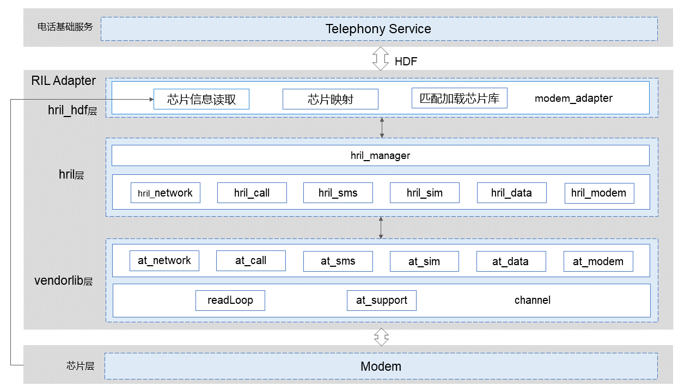

# RIL Adapter<a name="ZH-CN_TOPIC_0000001106353742"></a>

-   [简介](#section117mcpsimp)
-   [目录](#section122mcpsimp)
-   [约束](#section126mcpsimp)
-   [使用说明](#section264mcpsimp)
-   [相关仓](#section279mcpsimp)

## 简介<a name="section117mcpsimp"></a>

RIL Adapter模块主要包括厂商库加载，业务接口实现以及事件调度管理。主要用于屏蔽不同modem厂商硬件差异，为上层提供统一的接口，通过注册HDF服务与上层接口通讯。

**图 1**  RIL Adapter模块架构图<a name="fig1675210296494"></a>


## 目录<a name="section122mcpsimp"></a>
```sh
base/telephony/ril_adapter
├── figures                             # readme资源文件
├── frameworks
│   ├── BUILD.gn
│   └── src                             # 序列化文件
├── interfaces                          # 对应提供上层各业务内部接口
│   └── innerkits
├── services                            # 服务
│   ├── hril                            # hril层的各个业务模块接口实现
│   ├── hril_hdf                        # 提供初始化厂商库接口
│   └── vendor                          # 厂商库文件
│── test                                # 测试代码
│   ├── BUILD.gn
│   └── unittest                        # 单元测试代码
└── utils                               # 通用工具类
```

## 约束<a name="section126mcpsimp"></a>

-   软件上，需要与以下服务配合使用：HDF(drivers\_interface，driver\_peripheral), 需要Modem厂商库实现接口。
-   硬件上，需要搭载的设备支持以下硬件：可以进行独立蜂窝通信的Modem。

## 使用说明<a name="section264mcpsimp"></a>

ril\_adapter不对外暴露接口，可通过driver\_peripheral调用。

## 相关仓<a name="section279mcpsimp"></a>

[电话服务子系统](https://gitee.com/openharmony/docs/blob/master/zh-cn/readme/%E7%94%B5%E8%AF%9D%E6%9C%8D%E5%8A%A1%E5%AD%90%E7%B3%BB%E7%BB%9F.md)

**telephony_ril_adapter**

[drivers_interface](https://gitee.com/openharmony/drivers_interface)

[drivers_peripheral](https://gitee.com/openharmony/drivers_peripheral)

