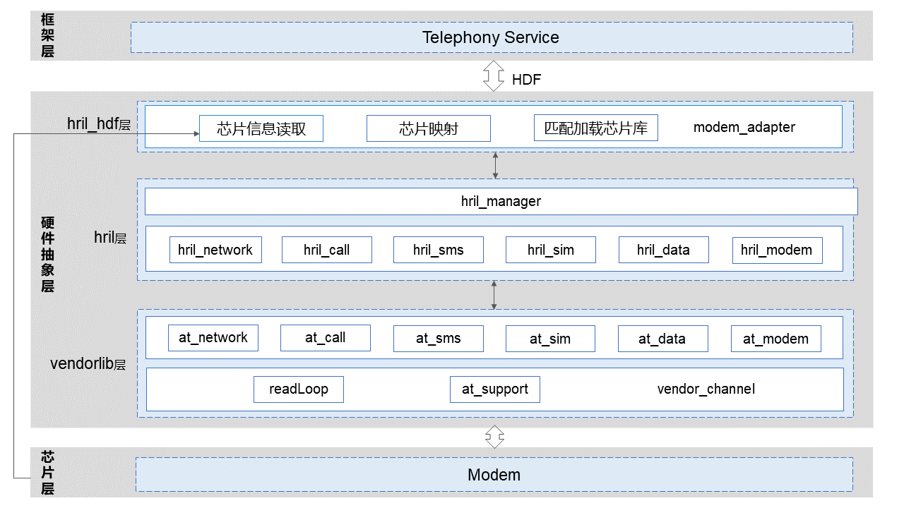

# RIL Adapter<a name="ZH-CN_TOPIC_0000001106353742"></a>

-   [简介](#section117mcpsimp)
-   [目录](#section122mcpsimp)
-   [约束](#section126mcpsimp)
-   [使用说明](#section264mcpsimp)
-   [相关仓](#section279mcpsimp)

## 简介<a name="section117mcpsimp"></a>

RIL Adapter模块主要包括厂商库加载，业务接口实现以及事件调度管理。主要用于屏蔽不同modem厂商硬件差异，为上层提供统一的接口，通过注册HDF服务与上层接口通讯。

**图 1**  RIL Adapter模块架构图<a name="fig1675210296494"></a>  


## 目录<a name="section122mcpsimp"></a>
```
base/telephony/ril_adapter
├─ hril							   # hri层的各个业务模块接口实现
├─ hril_hdf						   # HDF服务
├─ include                         # 头文件存放目录
├─ interfaces					   # 对应提供上层各业务内部接口
│  └─ innerkits
├─ test                            # 单元测试相关代码
│  ├─ mock                            
│  └─ unittest                     # 单元测试代码
└─ vendor                          # 厂商库代码
│  └─ include
```

## 约束<a name="section126mcpsimp"></a>

-   软件上，需要与以下服务配合使用：Telephony核心服务（core\_service），需要Modem厂商库实现接口。
-   硬件上，需要搭载的设备支持以下硬件：可以进行独立蜂窝通信的Modem。

## 使用说明<a name="section264mcpsimp"></a>

ril\_adapter不对外暴露接口，可通过核心服务调用。

## 相关仓<a name="section279mcpsimp"></a>

电话服务子系统

telephony_ril_adapter

telephony_core_service
